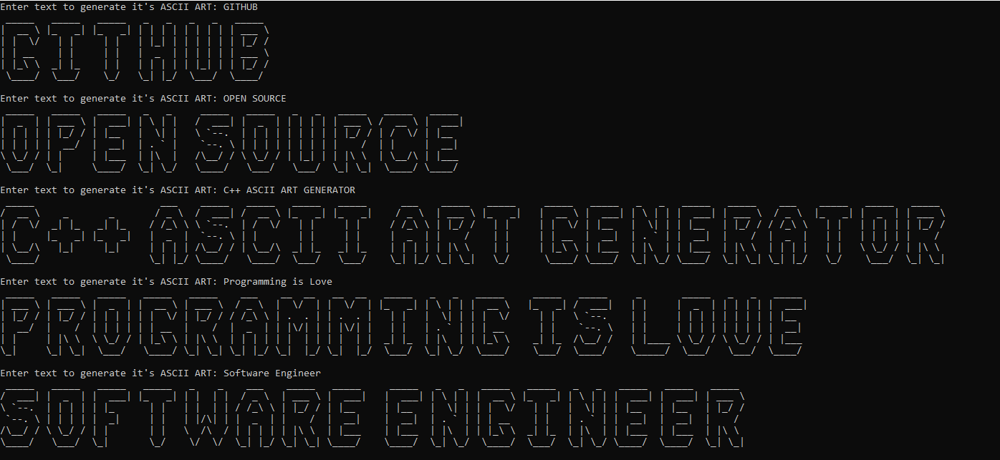

# C++ ASCII ART GENERATOR

### It is a C++ program which you can use to generate ASCII Art of any word. It prints the entered word in large text using ASCII characters.

# Output

# Credits

Author: Lord Hypersonic

[Author's Website](https://lordhypersonic.blogspot.com/)

Modified By: Sheharyar
